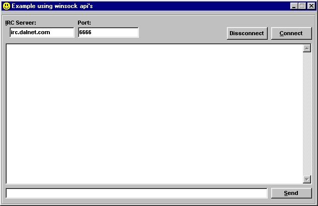



## Easy Tutorial On Winsock API's

### Description

This program will teach you how to use the winsock api's. I made this easy to understand so that anybody can use it. even beginers! isn't that crazy? *fixed, with subclassing function now!* if you like this, please vote for me! thanks!
 
### More Info
 

             |
---                |---
**Submitted On**   |2000-04-24 09:12:50
**By**             |[Brian Molidor](https://github.com/Planet-Source-Code/PSCIndex/blob/master/ByAuthor/brian-molidor.md)
**Level**          |Beginner
**User Rating**    |4.5 (77 globes from 17 users)
**Compatibility**  |VB 4\.0 \(32\-bit\), VB 5\.0, VB 6\.0
**Category**       |[Internet/ HTML](https://github.com/Planet-Source-Code/PSCIndex/blob/master/ByCategory/internet-html__1-34.md)
**World**          |[Visual Basic](https://github.com/Planet-Source-Code/PSCIndex/blob/master/ByWorld/visual-basic.md)
**Archive File**   |[CODE\_UPLOAD50774222000\.zip](https://github.com/Planet-Source-Code/brian-molidor-easy-tutorial-on-winsock-api-s__1-7440/archive/master.zip)

